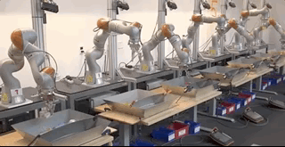

[//]: # (Image References)
[image2]: https://user-images.githubusercontent.com/10624937/42386929-76f671f0-8106-11e8-9376-f17da2ae852e.png "Kernel"

# DeepRLReacher

This is my submission for Udacity's Deep Reinforcement Learning Nanodegree for Project 2.

## Introduction

Using the [Reacher](https://github.com/Unity-Technologies/ml-agents/blob/master/docs/Learning-Environment-Examples.md#reacher) environment, this project's goal is to be able to continuously hold the double-jointed arm's position at the target location as long as possible, and therefore, as many timesteps as possible. 

This project has initially two versions: 

1. The first version contains a single agent.
2. The second version contains 20 identical agents, each with its own copy of the environment.

### Option 1: Solve the First Version
The task is episodic, and in order to solve the environment, your agent must get an average score of +30 over 100 consecutive episodes.

### Option 2: Solve the Second Version
The barrier for solving the second version of the environment is slightly different, to take into account the presence of many agents. In particular, your agents must get an average score of +30 (over 100 consecutive episodes, and over all agents). Specifically,

After each episode, we add up the rewards that each agent received (without discounting), to get a score for each agent. This yields 20 (potentially different) scores. We then take the average of these 20 scores.
This yields an average score for each episode (where the average is over all 20 agents).
After each episode, we add up the rewards that each agent received (without discounting), to get a score for each agent. This yields 20 (potentially different) scores. We then take the average of these 20 scores.
This yields an average score for each episode (where the average is over all 20 agents).
As an example, consider the plot below, where we have plotted the average score (over all 20 agents) obtained with each episode.


## Sharing experience in the real world
I opted for the second version. Apart from it appears more interesting, in the real world, we often do not learn in isolation. For instance, when we get stuck on something, we normally ask other people for help, or google solutions. Hence, version 2 mimics closely to what actually happens in real life. In essence, having multiple copies of the same agent sharing experience can accelerate learning!

The observation space consists of 33 variables corresponding to position, rotation, velocity, and angular velocities of the arm. Each action is a vector with four numbers, corresponding to torque applicable to two joints. Every entry in the action vector should be a number between -1 and 1. A reward of +0.1 is achieved at every timestep that the agent's hand is in the goal location. Hence, the goal of the agent is to therefore maintain its position at the target location for as many time steps as possible.

Agents must get an average score of +30 (over 100 consecutive episodes, and over all agents).The environment is considered solved, when the average (over 100 episodes) of those average scores is at least +30.

<div align="center">

</div>

## Simulation Environment
Unity Machine Learning Agents (ML-Agents) is an open-source Unity plugin that enables simulations to serve as environments for training intelligent agents.
For this project, work with the [Reacher](https://github.com/Unity-Technologies/ml-agents/blob/master/docs/Learning-Environment-Examples.md#reacher) environment.
<div align="center">

</div>

## Getting Started
The Project is for Udacity Deep Reinforcement learning nd. 

### Download the Unity Environment
- Linux: [click here](https://s3-us-west-1.amazonaws.com/udacity-drlnd/P2/Reacher/Reacher_Linux.zip)
- Mac OSX: [click here](https://s3-us-west-1.amazonaws.com/udacity-drlnd/P2/Reacher/Reacher.app.zip)
- Windows (32-bit): [click here](https://s3-us-west-1.amazonaws.com/udacity-drlnd/P2/Reacher/Reacher_Windows_x86.zip)
- Windows (64-bit): [click here](https://s3-us-west-1.amazonaws.com/udacity-drlnd/P2/Reacher/Reacher_Windows_x86_64.zip)

### Establish Dependencies

The current Unity ML-Agents environment only supports `Python 3.6` Hence, the following steps need to be followed.

1. Create and activate a new environment with `Python 3.6`

	- __Linux__ or __Mac__: 
	```bash
	conda create --name drl python=3.6
	source activate drl
	```
	- __Windows__: 
	```bash
	conda create --name drl python=3.6 
	activate drl
	```

2. Clone the deep reinforcement learning repository, and navigate to the `python/` folder.  Install several dependencies.
```bash
git clone https://github.com/udacity/deep-reinforcement-learning.git
cd deep-reinforcement-learning/python
pip install .
```

3. Create an [IPython kernel](http://ipython.readthedocs.io/en/stable/install/kernel_install.html) for the `drl` environment.  
```bash
python -m ipykernel install --user --name drl --display-name "drl"
```

4. Run Jupyter notebook environment

```
jupyter notebook 
```
5. Navigate to [Continuous_Control.ipynb](https://github.com/avpresbitero/deep-rl-reacher/blob/master/Continuous_Control.ipynb). Change the kernel to match the `drl` environment by using the drop-down `Kernel` menu. 

### License

This project is licensed under the MIT License
