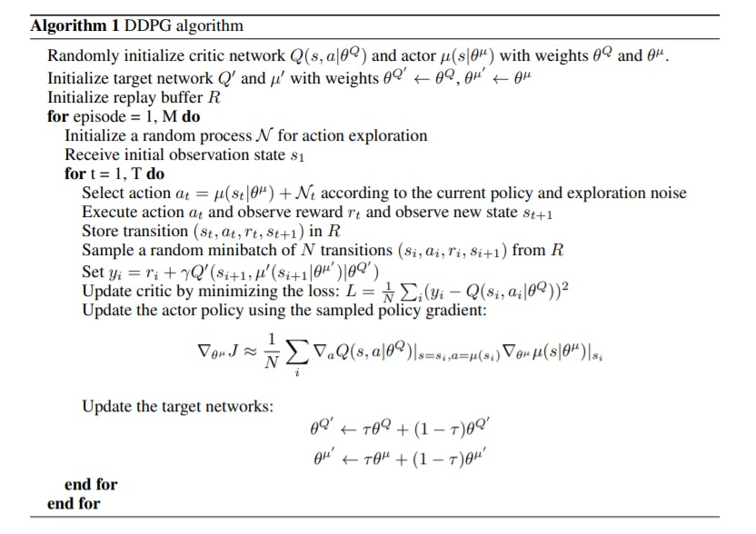
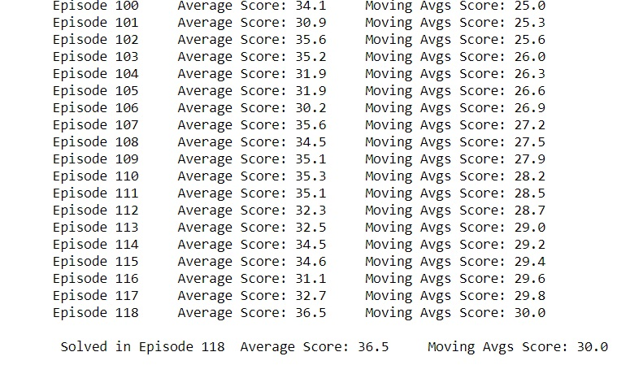
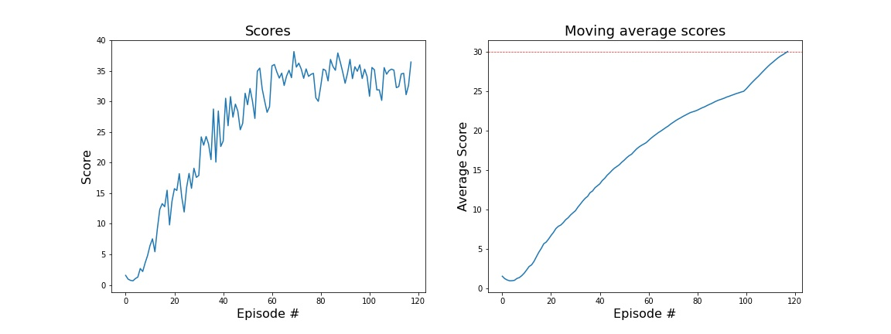
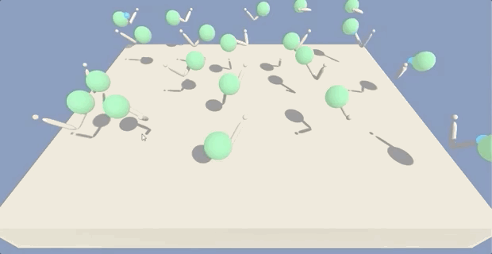

# DeepRLReacher : Continuous Control
## Exective Summary

This report is for my second project on the Udacity Deep Reinforcement learning course using the [Reacher](https://github.com/Unity-Technologies/ml-agents/blob/master/docs/Learning-Environment-Examples.md#reacher) environment. The goal of this project is to be able to be able to continuously hold the double-jointed arm's position at the target location as long as possible, and therefore, as many timesteps as possible. 


## The Solution
In the previous [project](https://github.com/avpresbitero/deep-rl-banana), I used DQN to solve the Banana problem. While DQN solves problems with high-dimensional observation spaces, it can only handle discrete and low-dimensional action spaces. DQN cannot be straightforwardly applied to continuous domains since it relies on a finding the action that maximizes the action-value function, which in the continuous valued case requires an iterative optimization process at every step.

For this project, the algorithm I will be using is the Deep Deterministic Policy Gradients (DDPG) algorithm written by Lillicrap et al in their specific work entitled: [Continuous control with deep reinforcement learning](https://arxiv.org/pdf/1509.02971.pdf)

<div align="center">

</div>
<div align="center">
<u> **Figure 1** </u>: **Pseudocode**<br>  
</div>

The DDPG follows an actor-critic model, where both parts are made out of neural networks. The actor is used to approximate the optimal policy deterministically. That is, it simply takes the action with the maximum state-action value. The critic then elarns to evaluate the optimal action value function by spewed out by the actor.

## Model Specifics

Setting the parameter "WEIGHT_DECAY = 0 " prevents overfitting. This is because adding weights to the model would penalize the network parameters and would not put much weight on the feautures. Implemetation of the [Batch Normalization](https://arxiv.org/pdf/1502.03167.pdf) would accelerate training.

The first and second layers were set to 512 units. Introducing a decaying epsilon also appeared to be a good idea as it helped in training the model.



Hyperparameters:
```
BUFFER_SIZE = int(1e6)  # replay buffer size
BATCH_SIZE = 128        # minibatch size
GAMMA = 0.99            # discount factor
TAU = 1e-3              # for soft update of target parameters
LR_ACTOR = 1e-3         # learning rate of the actor
LR_CRITIC = 1e-3        # learning rate of the critic
WEIGHT_DECAY = 0        # L2 weight decay
EPSILON_DECAY = 1e-6    # epsilon decay
EPSILON = 1.0           # exploration actions space
LEARN_INTERVAL = 20     # learning 10 times per 20 timesteps   
LEARN_TIMES = 10   
```

Model Structure


|  NN       |   fc1_units      | fc2_units   | EPSILON , EPSILON_DECAY| output_layer |
|------------|------------------|-------------|-----------|--------------|
|  Actor     |  512             | 512         |  1.0 , 1e-6     | 4            |
|  Critic    |  512             | 512         |  1.0 , 1e-6      | 1            |

### Result



## Summary and Conclusion
Changing the number of fully connected units/nodes had an effect ont the performance of the model. Adding the epsilon and decaying this overtime also improved the learning process. Finally, batch-normalization did a tremendous job in improving the model. Batch normalization refers to the process of making neural networks perform faster and becoming more stable through adding extra layers in the deep neural network. The new layer performs the standardizing and normalizing operations on the input of a layer coming from a previous layer.


<div align="center">

</div>
<div align="center">
</div>

## Recommendations and Future Works
Although DDPG was able to solve the problem at hand, I still find it a bit on the slow end as the convergence takes place rather slowly. Exploring and trying out other algorithms would definitely be a good option such as the Distributed Distributional Deterministic Policy Gradients ([D4PG](https://openreview.net/forum?id=SyZipzbCb)) and Proximal Policy Optimization ([PPO](https://openai.com/blog/openai-baselines-ppo/)). Finally, the optional challenge (Crawl) also looks like a good training ground to learn more.